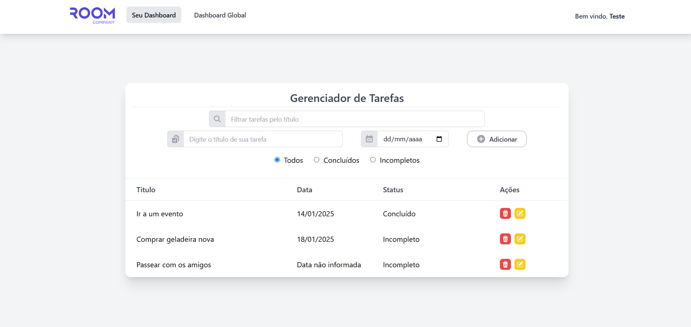

<h1 align="center"> Desafio Room Company - RoomTasker </h1>

O desafio consiste no desenvolvimento de uma aplicação web para um cadastro de usuário e gerenciamento de tarefas (Adicionar, listar, editar, excluir e filtrar tarefas)
---
## Índice

1. [Descrição do Projeto](#descrição-do-projeto)
2. [Tecnologias Utilizadas](#tecnologias-utilizadas)
3. [Arquitetura de Pastas](#arquitetura-de-pastas)
4. [Prints](#prints)
5. [Como Executar o Projeto](#como-executar-o-projeto)
---
## Descrição do Projeto

- Tela de Registro e Login de novos usuários com React
- RESTFUL API desenvolvida com NodeJS e TypeScript
- Criação, edição e deleção de tarefas
- Associação de usuário em tarefas
- Tela de cadastro de tarefas com filtro de tarefas por título e por status
- Tela de gerenciamento de tarefas com filtro por usuários

--- 

## Tecnologias Utilizadas

#### Frontend
- **React.js e Typescript**
- **Tailwind** e **heroicons** para estilização
- **Axios** para requisições HTTP

[](https://skillicons.dev)

#### Backend
- **Node.js e Typescript**
- **Express** framework de rotas
- **Prisma** para ORM e interação com MongoDB
- **MongoDB** como banco de dados

[](https://skillicons.dev)

---

## Arquitetura de Pastas:

##### Backend:
```plaintext
├── src
│   ├── controllers
│   ├── middlewares
│   ├── models
│   ├── routes
│   └── services
├── .env
├── .gitignore
├── package.json
└── tsconfig.json
```

##### Frontend:
```plaintext
├── src
│   ├── assets
│   ├── components
│   └── services
│   ├── App.tsx
│   ├── main.tsx
├── index.html
├── .gitignore
├── package.json
├── tsconfig.json
└── vite.config.ts
└── ... (outros arquivos de configuração)
```
---

## Prints

Página de Registro:


Gerenciador de Tarefas (Dashboard):


Visualizar Todas as Tarefas Cadastradas com filtro por Usuário:


--- 

## Como Executar o Projeto

Rodar o backend (api):<br>
    - cd backend<br>
    - npm run dev<br>

    - O backend estará disponível em http://localhost:3000.

Rodar o frontend:<br>
    - cd frontend<br>
    - npm run dev
